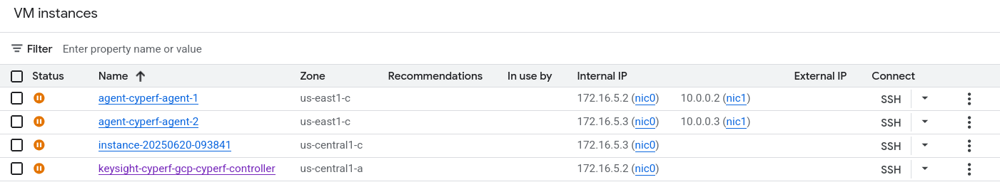
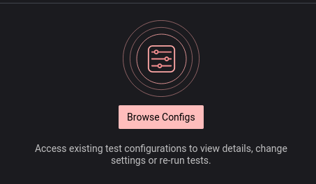
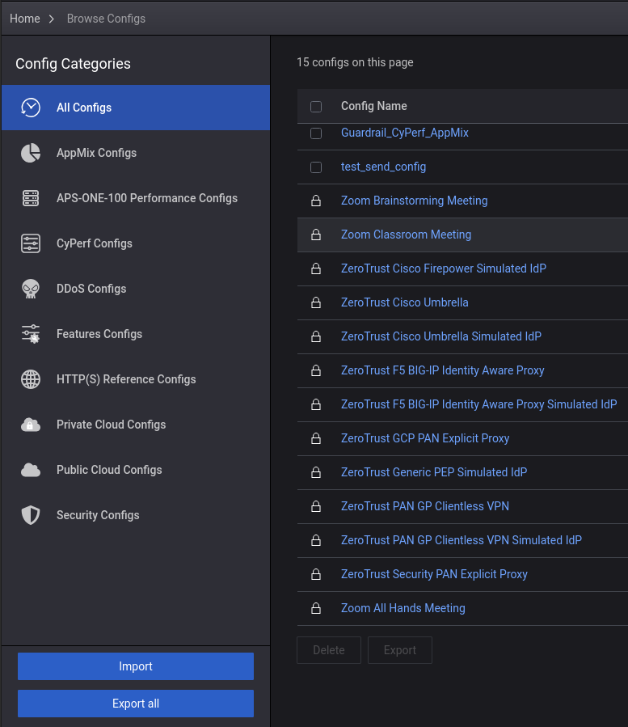
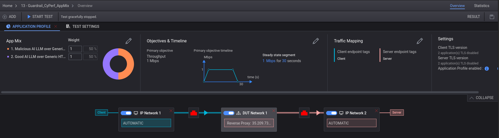
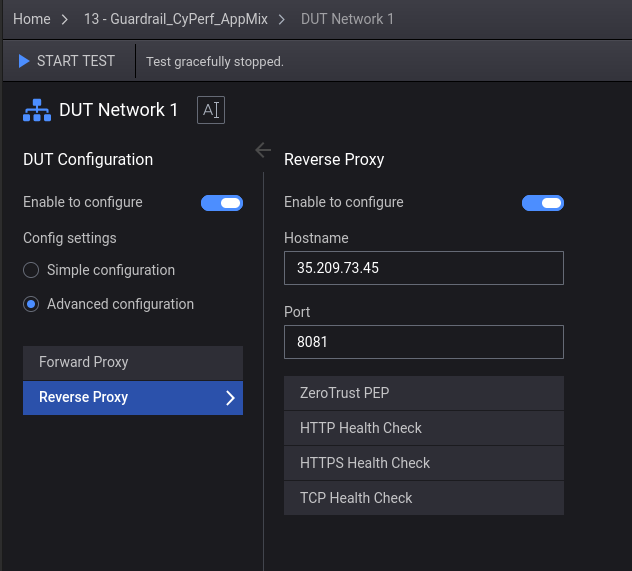
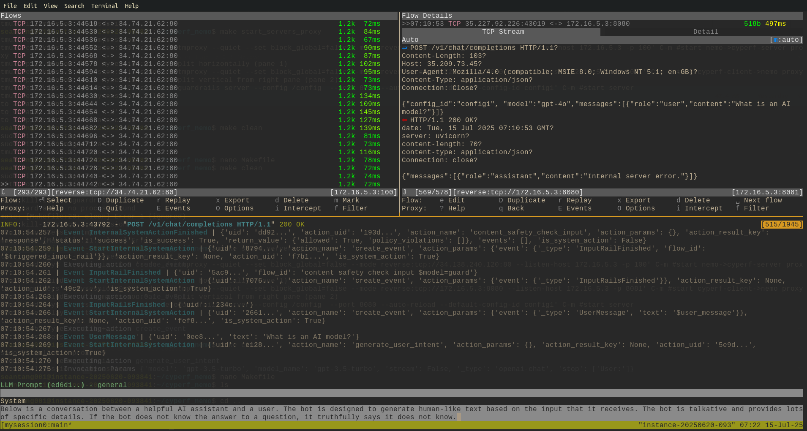

# Setting Up CyPerf to test with Nvidia Nemo Guardrail

In this writeup, we setup the necessary GCP infrastructure to test a Nemo LLM Guardrail server with simulated requests sent via CyPerf. 

## GCP Setup

### GCP setup with controller-agent pair

To setup GCP, we can use the deployment scripts provided in the [controller-agent pair deployment script](https://github.com/Keysight/cyperf/tree/CyPerf-6.0/deployment/gcp/deploymentmanager/controller_and_agent_pair) provided by the cyperf github repo. The specific script to use may differ based on your region, but for our setup we deployed to the US-Central region using the following:

```
> gcloud deployment-manager deployments create keysight-cyperf-gcp --template cyperf_controller_and_agent_pair_new_vpc.py --properties zone:us-central1-c,region:us-central1,agentMachineType: c2-standard-4,agentSourceImage:keysight-cyperf-agent-6-0, managementNetworkCIDR:172.16.5.0/24,testNetworkCIDR:10.0.0.0/8,agentCount:2,controllerSourceImage:keysight-cyperf-controller-6-0,controllerMachineType: c2-standard-8,uthUsername:"admin",authPassword:"CyPerf&Keysight#1"
```
{: style="max-width:100%;" }

Separately, spin up a VM instance via the gcp compute engine gui. This separate instance will be used to host the Nemo guardrail server itself. 

Your VM instances should end up looking something like this:

{: style="max-width:100%;" }


### GCP setup with single agent

Note, our original setup involved running the [individual controller scripts](https://github.com/Keysight/cyperf/tree/CyPerf-6.0/deployment/gcp/deploymentmanager/single_agent) first and then running the agent script later hence the different region; we recommend using the [controller-agent pair deployment script](https://github.com/Keysight/cyperf/tree/CyPerf-6.0/deployment/gcp/deploymentmanager/controller_and_agent_pair) as it is more convenient and insures correct configuration. 

## Nemo guardrail setup

Once the VM instance is setup, ssh into the machine and download the nemoguardrail. In our case, we used pip:

```bash
pip install nemoguardrails[dev]
```

This will have added to your path an runnable script called `nemoguardrails`. We will specifically use the server mode. 

In order to use the server mode, we need to have the correct configuration. Download the configuration and other helper scripts needed to run the setup from this [google drive file](https://drive.google.com/file/d/1jLBcJc_K9UPlNJQBKg-BzTjGyyO-bv7z/view?usp=sharing).

Once downloaded, `scp` to the VM instace and unzip the file. 

Make sure to add your `open-ai` API key to `./config/config1/config.yaml`. For example:

```yaml
  - type: main
    engine: openai
    parameters:
      model: gpt-3.5-turbo
      #base_url: http://34.73.65.227/v1/
      #base_url: http://172.16.5.3:100/v1/
      api_key: "sk-proj-EspX4NttydBfw-YsF00"

```

At the root of the folder, run the make target to start the server and proxies (the proxy helps visualize the traffic and also resolves some HTTP issues):

```bash
> make start_servers_proxy
```
to see the traffic, run 
```bash
> tmux a
```
to stop the server and proxies, exit out of tmux with `ctrl+b d' and run the clean target:
```bash
> make clean
```

You can examine the make recipe and also the config folder to understand what configuration was used for the guardrail server. 

## CyPerf controller setup

Download the configuration from [here](https://drive.google.com/file/d/1NU32RK-4jTjKxd3n8PEK3nJEYWVSWnh6/view?usp=sharing). 

In CyPerf, open the `Browse Configs` tab via the Config Icon:

{: style="max-width:100%;" }


Then, use the `Import` button to import the downloaded configuration zip:

{: style="max-width:100%;" }


Then, you will need to modify the `DUT` modal box here:

{: style="max-width:100%;" }


The reverse-proxy IP will likely need to be changed, so update it to be the controller you choose as your server. 

{: style="max-width:100%;" }


Now, you should be ready to run the test.

## Running the test

If your test runs correctly, you should be able to see proxy going through your tmux shell on the nemo guardrail server. 

{: style="max-width:100%;" }
